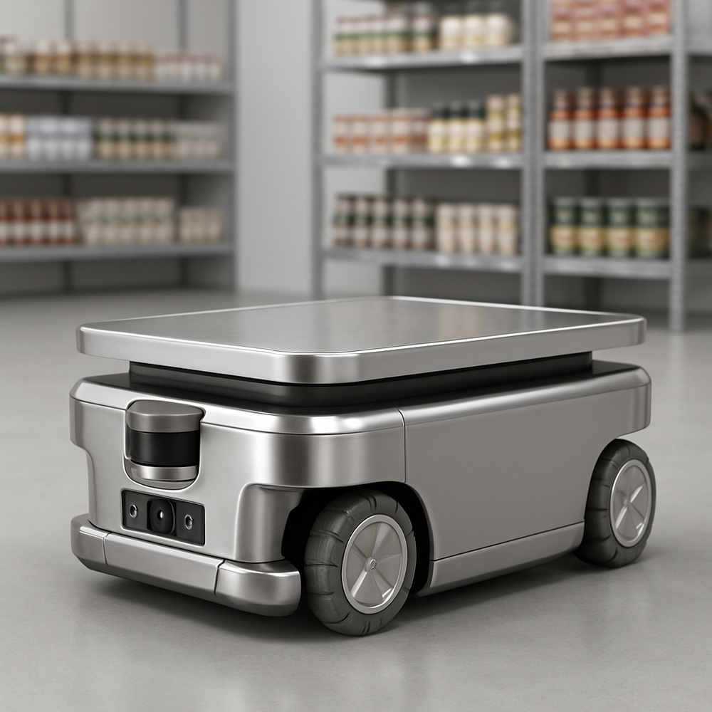
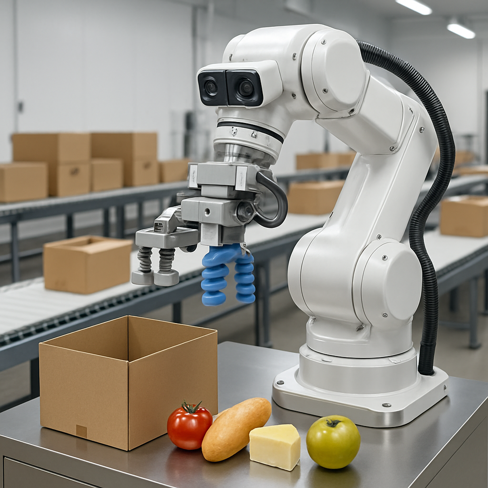

# Automated Food Warehouse Robot System

This document outlines the operational algorithms, design specifications, and working envelopes for the robots in an automated food warehouse system.

## 1. Execution Algorithms (Step-by-Step Operations)

### 1.1. Autonomous Mobile Robot (AMR) Operations

1.  **Receive Task:** AMR receives a transport task from the Warehouse Management System (WMS), specifying pick-up and drop-off locations for pallets or totes.
2.  **Path Planning:** Utilizes an internal navigation system to calculate the optimal, obstacle-free path to the pick-up location.
3.  **Navigate to Pick-up:** Moves autonomously along the planned path, using sensors (LIDAR, cameras) for real-time obstacle avoidance and localization.
4.  **Load Item:** Positions itself precisely at the pick-up location. If equipped with a lift mechanism, it raises to engage the pallet/tote.
5.  **Navigate to Drop-off:** Calculates a new optimal path to the drop-off location.
6.  **Unload Item:** Moves to the drop-off location and unloads the item.
7.  **Report Completion:** Updates the WMS on task completion and its current status (idle, busy).
8.  **Return to Base/Next Task:** Proceeds to a charging station or awaits the next task.

### 1.2. Picking and Packing Robot Operations

1.  **Receive Order:** Receives a picking order from the WMS, detailing items, quantities, and destination (e.g., packing station).
2.  **Locate Item:** Uses its vision system (2D/3D cameras) to identify and locate the specific product within its picking area.
3.  **Grasp Item:** Extends its robotic arm and uses the appropriate gripper to carefully grasp the item, adjusting force based on product fragility.
4.  **Verify Pick:** Confirms the correct item and quantity using sensors and vision.
5.  **Place Item:** Moves the item to the designated packing container or conveyor belt.
6.  **Repeat/Pack:** Continues picking items for the order until complete. If packing, it may arrange items within the container.
7.  **Report Completion:** Notifies the WMS of successful picking/packing for the order.
8.  **Await Next Task:** Returns to a ready state for the next picking order.

## 2. Robot Design and Dimensions

### 2.1. Autonomous Mobile Robot (AMR) Design and Dimensions

*   **Design:** Low-profile, robust chassis made of stainless steel and food-grade plastics. Features omnidirectional wheels for high maneuverability. Equipped with integrated sensors for navigation and safety.
*   **Dimensions (Approximate):**
    *   Length: 1.2 - 1.5 meters
    *   Width: 0.8 - 1.0 meters
    *   Height: 0.3 - 0.5 meters (excluding lift mechanism, if present)
    *   Weight: 150 - 300 kg (unloaded)
    *   Payload Capacity: 500 - 1500 kg

### 2.2. Picking and Packing Robot Design and Dimensions

*   **Design:** Multi-axis robotic arm (typically 6 or 7 degrees of freedom) mounted on a stable base. Features interchangeable grippers for handling diverse food products. Integrated with high-resolution vision systems for precise item recognition and manipulation.
*   **Dimensions (Approximate):**
    *   Reach (Arm Extension): 0.8 - 1.5 meters (from base center)
    *   Footprint (Base): 0.5 x 0.5 meters to 1.0 x 1.0 meters
    *   Height (Max Extension): 1.5 - 2.5 meters
    *   Payload Capacity (Gripper): 1 - 10 kg (per pick)

## 3. Working Envelope

### 3.1. Autonomous Mobile Robot (AMR) Working Envelope

*   **Definition:** The 3D space within the warehouse floor where the AMR can safely and effectively operate, including its movement paths and areas for loading/unloading.
*   **Key Elements:**
    *   **Floor Area:** All designated aisles, pick-up/drop-off zones, and charging stations.
    *   **Vertical Clearance:** The maximum height of the AMR plus its load, ensuring clearance from overhead obstacles (e.g., pipes, lights, sprinkler systems).
    *   **Restricted Zones:** Areas explicitly excluded from AMR operation (e.g., human-only zones, offices, maintenance areas).
    *   **Dynamic Obstacles:** The ability to detect and navigate around temporary obstacles (e.g., human workers, fallen items).

### 3.2. Picking and Packing Robot Working Envelope

*   **Definition:** The specific 3D volume that the robotic arm can reach and manipulate items within, typically confined to a workstation.
*   **Key Elements:**
    *   **Arm Reach:** The maximum extent of the robotic arm in all directions (horizontal and vertical) from its base, defining its operational sphere.
    *   **Workstation Volume:** The space encompassing input conveyors, picking bins, packing containers, and any associated equipment (e.g., vision system cameras).
    *   **Safety Zone:** A defined perimeter around the robot's operational area where human entry is restricted during operation, often enforced by safety light curtains or physical barriers.
    *   **Interaction Points:** Specific points within the envelope where the robot interfaces with other systems (e.g., receiving items from a conveyor, placing items into a box).

